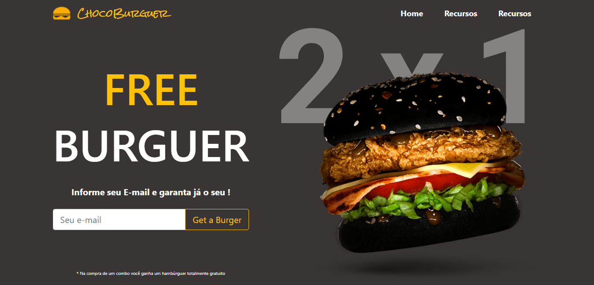

<h1>Desafio #1: Ecommerce 💻</h1>

## Sobre

> Este projeto foi desenvolvido para concluir o desafio do **Hiring Coders**, com o objetivo de criar uma landing page de um e-commerce.

### Projeto em andamento 🚀👩‍💻

## Entregáveis

* Template do site oficial  
* Landing page de promoções, estilo black friday;  
* Cadastre seu e-mail para receber promoções  
* Dados no localstorage

## Recursos e Ferramentas 

* Git 
* Github 
* Visual Studio Code 
* Html 
* CSS 
* JavaScript

  

***"A persistência é o caminho do êxito"*** ✍️
